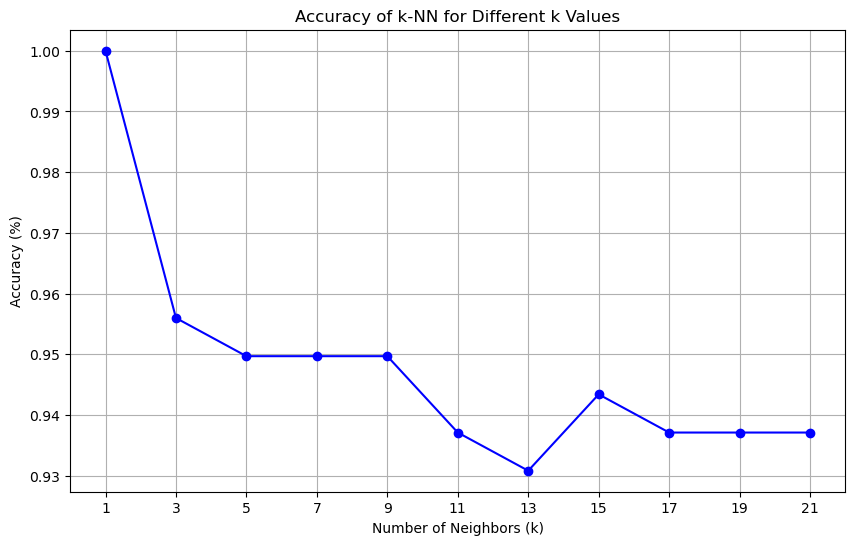
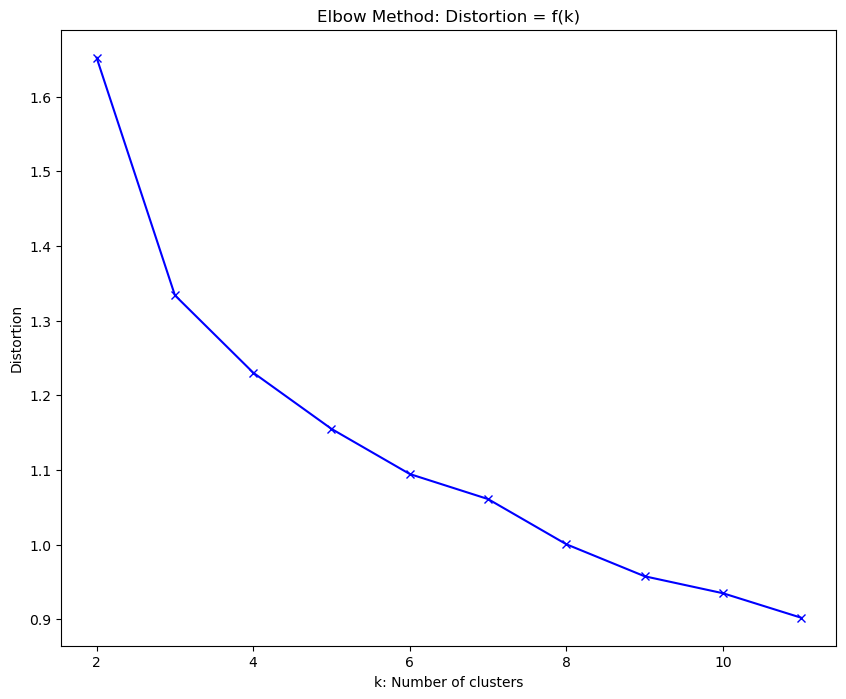
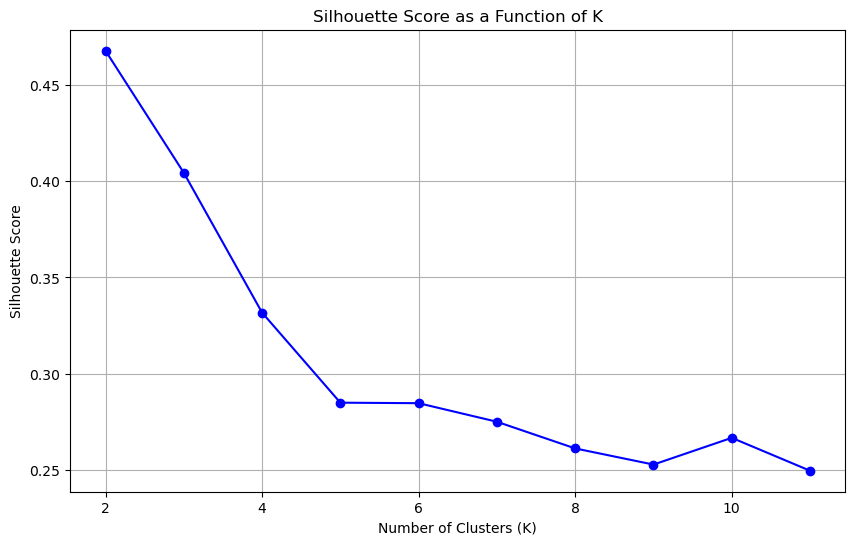

# 🌾 Wheat Seed K-Nearest Neighbors Classification and K-Means Clustering

This project applies both **supervised** and **unsupervised** learning techniques on a wheat seed dataset, utilizing k-Nearest Neighbors (k-NN) for classification and K-Means for clustering. By analyzing various characteristics of wheat seeds, we aim to classify them into groups and find natural clusters in the data.

## 🚀 Project Highlights

- **Dataset**: Wheat seed dataset, which includes features such as **area**, **perimeter**, **compactness**, **kernel length**, and more.
- **Classification**: Implemented **k-NN** classification with multiple values of \( k \) to find the optimal number of neighbors for accurate predictions.
- **Clustering**: Applied **K-Means clustering** and evaluated performance using **silhouette scores** and **distortion metrics** to determine the ideal number of clusters.
- **Visualization**: Detailed visualizations to help interpret model performance, including:
  - Accuracy as a function of \( k \) for k-NN
  - Elbow method plot for K-Means distortion
  - Silhouette scores across different cluster counts
  
---

## 📊 Visualizations

### 1. k-NN Accuracy vs. Number of Neighbors \( k \)
This plot demonstrates the effect of different \( k \) values on classification accuracy. We used a range of values to analyze how changing \( k \) influences the classifier's performance.

### 2. Elbow Method for K-Means Clustering
The elbow plot helps to determine the optimal number of clusters by plotting the sum of squared distances (distortion) for each \( K \). The "elbow" point indicates the best choice for \( K \).

### 3. Silhouette Scores as a Function of Clusters
Silhouette scores provide insights into the compactness and separation of clusters. Higher silhouette scores indicate better-defined clusters.

---

## 🛠️ Implementation Details

### Data Preprocessing
- **Standardization**: Standardized features to have a mean of 0 and a standard deviation of 1, which improves the performance of distance-based algorithms like k-NN and K-Means.

### Models and Metrics
- **k-Nearest Neighbors**:
  - Tested various values of \( k \) to determine the optimal neighbor count for classification.
  - Evaluated using **accuracy** on the test dataset.
- **K-Means Clustering**:
  - Calculated **distortion** and **silhouette scores** to find the ideal number of clusters.

---

## 📁 Files and Structure

- **`Wheat_Seeds_KNN_and_Clustering_Final.ipynb`**: Jupyter Notebook containing all code, including data preprocessing, model training, and visualizations.
- **`seeds_dataset.txt`**: Raw dataset file with wheat seed measurements and class labels.
- **Images**: Graphs and plots generated during analysis, such as accuracy vs. \( k \), elbow method, and silhouette score plots.

---
